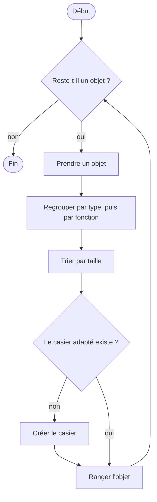

# Introduction à l'algorithmie

## 1. Qu'est-ce qu'un algorithme ?

Un **algorithme** est une suite **finie** d'instructions **non ambiguës** qui transforme des **données** en un **résultat**. On en suit tous les jours : une recette de cuisine, un itinéraire, une notice de montage.

Apprendre l'algorithmie, c'est apprendre à résoudre un problème en structurant la mise en oeuvre d'une solution, **avant** de l'écrire dans un langage de programmation.

---

## 2. Exemple concret

**Enjeu** : Être plus efficace dans le bricolage de ma voiture

**Objectif** : Ranger son armoire de bricolage pour la voiture

**Étapes** :

- Regrouper les objets « voiture »
- Trier les objets « voiture »
- Créer/adapter le rangement « voiture »

### Enchaînements

Pour chaque objet de l'univers Voiture :

1. **Regrouper** avec le même type d'objet (outils/pièces/vis, etc.)
2. **Regrouper à nouveau** par fonctionnalités (clés avec clés, tournevis avec tournevis, etc.)
3. **Trier** par sa taille (clés de taille mini à maxi)
4. **Choisir le casier adapté** (une vis est la plus petite mais la quantité la plus grande ; si casier n'existe pas alors le créer)
5. **Ranger** et reprendre un objet

Dessiné sous forme de schéma, cet enchaînement fait apparaître les trois briques de tout algorithme : des actions **en séquence**, une **condition** (le casier existe-t-il ?) et une **répétition** (pour chaque objet).

---

## 3. Généralisation de la solution

- Puis-je appliquer cet enchaînement au rangement de mon univers Vélo ?
- Si oui, quel changement va avoir lieu dans l'enchaînement ?
  - définition de l'univers
  - énumération des objets par univers
- Puis-je appliquer cet enchaînement au rangement de mon univers Menuiserie ? de la cuisine ? de mon magasin à l'atelier ?
- Quel autre exemple, significativement différent, proposez-vous ?

Seules les **données** changent (l'univers, la liste des objets) : l'algorithme reste le même. C'est tout l'intérêt d'un algorithme bien conçu.

---

## 4. Qu'est-ce qu'un bon algorithme ?

| Qualité | Question à se poser | Voir |
|---------|---------------------|------|
| **Correct** | Donne-t-il le bon résultat, et se termine-t-il toujours ? | tout le cours |
| **Lisible** | Un autre développeur le comprend-il (noms, commentaires, découpage) ? | chapitres [04](04_algorithme_methodologie.md), [10](10_fonctions.md) |
| **Efficace** | Combien d'opérations et de mémoire quand les données grossissent ? | chapitre [12](12_complexite_algorithmique.md) |
| **Simple** | Combien de chemins d'exécution faut-il tester ? | chapitre [13](13_complexite_cyclomatique.md) |

Un ordinateur plus puissant ne rend pas un algorithme inefficace efficace : il le rend seulement un peu plus rapide. Pour 1 million de données, un algorithme qui compare toutes les paires de valeurs fait de l'ordre de 1 000 milliards d'opérations, quelle que soit la machine.
