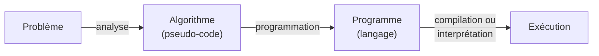

# Quelques définitions

## 1. Du problème au programme

| Terme | Définition |
|-------|------------|
| **Algorithme** | Méthode de résolution d'un problème, indépendante de tout langage |
| **Pseudo code** | Organisé comme un langage de programmation mais sans les soucis de syntaxes (conventions) : voir le chapitre [03](03_pseudo_code.md) |
| **Langage de programmation** | Convention d'instructions organisées (Python, C, PHP...) |
| **Instruction** | Consigne formulée dans un langage de programmation selon un code |
| **Programmation** | Permet de traduire l'algorithme dans un langage adapté à l'ordinateur |

---

## 2. Lexique informatique

- **RAM** : mémoire vive, où sont rangées les variables pendant l'exécution (son contenu est perdu à l'arrêt)
- **BIT** : information binaire (0 ou 1)
- **OCTET** : groupe de 8 bits (en anglais, Byte)
  - 2^8 possibilités soit 256 nombres différents
  - 2 octets : 65 536 possibilités (256*256)
  - 3 octets : 16 777 216 possibilités (256*256*256)
- **ASCII** : (American Standard Code for Information Interchange) standard de codage des caractères et ponctuations : chaque caractère correspond à un nombre (`A` vaut 65). Voir le chapitre [11](11_chaines_de_caracteres.md).

---

## 3. Modes d'exécution

Le processeur n'exécute que du **langage machine** : le programme source doit être traduit.

| Mode | Principe | Atout | Exemples |
|------|----------|-------|----------|
| **Compilation** | Le programme est traduit en une seule fois et stocké dans un exécutable | Plus rapide | C, C++... |
| **Interprétation** | Chaque ligne du programme source est traduite en instructions du langage machine au fur et à mesure | Plus de polyvalence — *multi-plateforme* | Vba, Php... |
| **Semi-compilé** | Combine les 2 techniques : compilation vers un code intermédiaire, puis interprétation | Compromis | Python, Java... |

AlgoFab, l'outil utilisé dans ce cours, est un **interpréteur** : il exécute l'algorithme instruction par instruction, ce qui permet de le suivre pas à pas.
