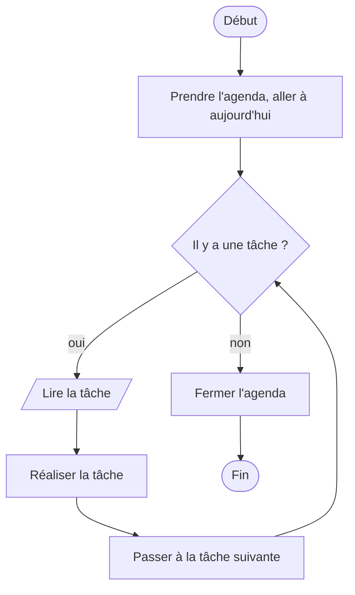

# Le pseudo code

## 1. Description

- Écriture d'algorithme à l'aide d'un vocabulaire simple
- Support informatique optionnel
- Possibilité d'échanger avec un développeur même sans connaître de langage particulier

---

## 2. Syntaxe

Pas de standard mais des conventions :

- **mots clés** en majuscules ou en gras : **Début**, **Fin**, **Si**, **Alors**, **Sinon**, **Tant Que**, **Pour**, **Jusqu'à**...
- **une instruction par ligne**
- **indentation** : les instructions d'un bloc (Si, Tant que...) sont décalées vers la droite
- `←` pour l'affectation : `total ← 0` se lit « total prend la valeur 0 »

Les opérateurs de calcul et de comparaison sont présentés aux chapitres [06](06_lecture_ecriture.md) et [07](07_structures_conditionnelles.md).

### Pseudo code libre et AlgoFab

À partir du chapitre 04, le cours utilise **AlgoFab**, un pseudo code aux mots clés imposés. Les chapitres 12 et 13 reviennent au pseudo code libre, plus compact :

| Pseudo code libre | AlgoFab |
|-------------------|---------|
| `x ← 3` | `x PREND_LA_VALEUR 3` |
| `Lire x`, `Afficher x` | `LIRE x`, `AFFICHER x` |
| `Si ... Alors ... Sinon ... Fin Si` | `SI (...) ALORS ... SINON ...` |
| `Pour i de 1 à n ... Fin Pour` | `POUR i ALLANT_DE 1 A n` |
| `Tant que ... Faire ... Fin Tant que` | `TANT_QUE (...) FAIRE` |
| `Répéter ... Jusqu'à condition` | `FAIRE TANT_QUE (NON condition)` : la condition est inversée |

---

## 3. Organigramme

Un algorithme peut aussi se **dessiner**. L'organigramme utilise des formes normalisées :

| Forme | Signification |
|-------|---------------|
| Ovale | Début, fin |
| Rectangle | Action (calcul, affectation) |
| Parallélogramme | Entrée, sortie (lire, afficher) |
| Losange | Décision : une question dont la réponse est oui ou non |

L'organigramme montre bien le **chemin** suivi à l'exécution ; le pseudo code est plus rapide à écrire et plus proche du programme final.

---

## 4. Exemple : Travail de la journée

```
algorithme : Travail de la journée
    Début
    prendre l'agenda
    aller à aujourd'hui
    TANT QUE il y a une tâche FAIRE
        Lire tâche
        Réaliser tâche
        Passer à la tâche suivante
    FIN TANT QUE
    Fermer agenda
    Fin
```

Le même algorithme en organigramme :



---

## Exercices

Fiche [exercices/03_pseudo_code.md](exercices/03_pseudo_code.md) : remettre des étapes dans l'ordre, écrire et dessiner des algorithmes de la vie courante.
