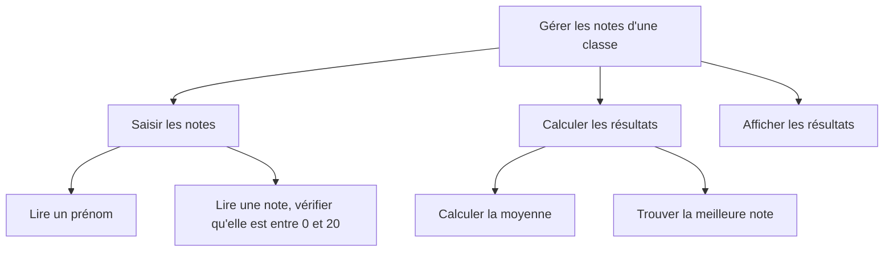
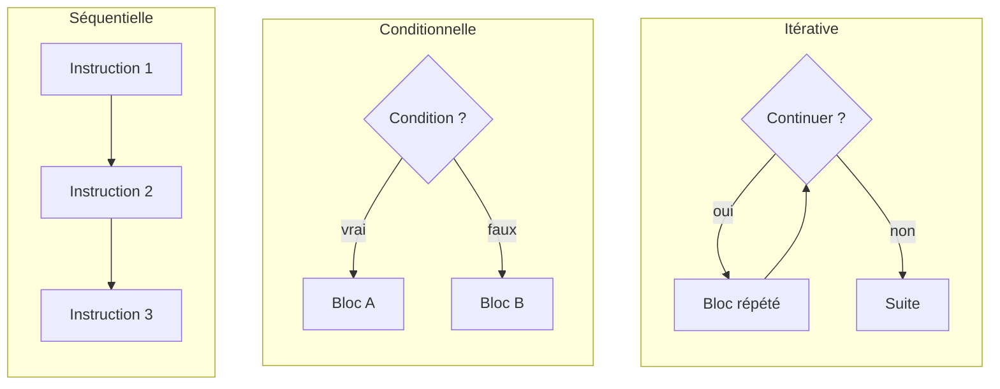

# L'algorithme

## 1. De quoi s'agit-il ?

Un algorithme transforme un **Problème** en une solution à travers :

- un **ensemble de règles**
- des **enchaînements** (structure)
- un **nombre fini d'opérations**

---

## 2. Méthodologie de conception : analyse descendante

L'analyse descendante consiste à décomposer un problème complexe en sous-problèmes simples, puis à recomposer les solutions pour obtenir l'algorithme principal.

1. **Décomposition** du problème
2. Identification de **sous-problèmes simples** (Ss Pb 1, ..., Ss Pb X)
3. **Recomposition** des algorithmes (Algo 1, ..., Algo X)
4. Obtention de l'**algorithme principal** et de la résolution

Exemple : gérer les notes d'une classe.



On décompose jusqu'à obtenir des sous-problèmes assez simples pour être écrits directement. Ce problème est l'exercice « Moyenne de la classe » du chapitre 08 ; au chapitre 10, chaque sous-problème pourra devenir une **fonction**.

Objectifs de la méthode :

- **Modularité** : 1 problème simple = 1 algorithme simple, réutilisable
- **Lisibilité** : mise en page, commentaires, description
- **Complexité maîtrisée** : enchaînements simples, durée d'exécution et espace mémoire mesurables (chapitres 12 et 13)

---

## 3. Les structures

Tout algorithme se construit avec trois structures :

| Structure | Description | Chapitres |
|-----------|-------------|-----------|
| **Séquentielle** | Ordonnancement des instructions | 05, 06 |
| **Conditionnelle** | Bloc d'instructions à exécuter selon circonstances | 07 |
| **Itérative** | Bloc d'instructions à exécuter plusieurs fois | 08 |



---

## 4. Syntaxe globale AlgoFab

### Écriture

Un algorithme AlgoFab est un **arbre de blocs** organisé en cinq sections fixes, toujours dans cet ordre. Le nom de l'algorithme est saisi dans le champ titre de l'application.

```
FONCTIONS_UTILISEES
  <Définition des fonctions>        (facultatif)
CONSTANTES
  <Déclaration des constantes>      (facultatif)
VARIABLES
  <Déclaration des variables>
DEBUT_ALGORITHME
  <Bloc Instructions>
FIN_ALGORITHME
```

À l'exécution : les fonctions sont enregistrées, les constantes calculées, les variables créées **sans valeur**, puis les instructions de `DEBUT_ALGORITHME` sont exécutées dans l'ordre.

### Exemple

```
VARIABLES
  puissance EST_DU_TYPE NOMBRE
  intensite EST_DU_TYPE NOMBRE
  tension EST_DU_TYPE NOMBRE
DEBUT_ALGORITHME
  puissance PREND_LA_VALEUR 4400
  intensite PREND_LA_VALEUR 20
  tension PREND_LA_VALEUR puissance / intensite
  AFFICHER tension ↵
FIN_ALGORITHME
```

Fichier : [exemples/04_tension.algo](exemples/04_tension.algo)

C'est une simple **séquence** : trois affectations (`PREND_LA_VALEUR`, chapitre 05) puis un affichage (`AFFICHER`, chapitre 06).

> Dans les exemples du cours, les sections vides (`FONCTIONS_UTILISEES`, `CONSTANTES`) ne sont pas recopiées.

Pour ouvrir un fichier `.algo` dans AlgoFab et l'exécuter : voir la présentation d'[AlgoFab](README.md#algofab).

---

## Exercices

Fiche [exercices/04_algorithme.md](exercices/04_algorithme.md) : décomposer un problème, reconnaître les structures, premier algorithme dans AlgoFab.
