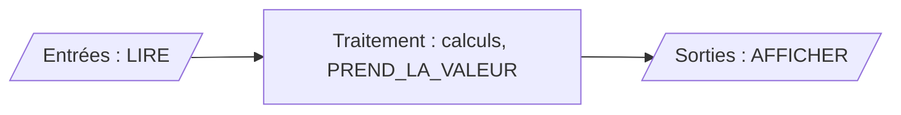

# Lecture, calculs et écriture

Un programme simple suit presque toujours le même schéma : **lire** des données, les **traiter** par des calculs, **afficher** le résultat.



## 1. Lecture

Récupérer une valeur provenant de l'extérieur (clavier).

Instruction : **LIRE**

- pour un `NOMBRE`, la saisie est évaluée comme un calcul : on peut taper `3+4`
- pour une `CHAINE`, le texte est pris tel quel
- pour un `BOOLEEN`, uniquement `VRAI` ou `FAUX`

> Un `AFFICHER` placé juste avant le `LIRE` (`AFFICHER "Rayon : "`) indique à l'utilisateur ce qu'il doit saisir.

---

## 2. Calculs

### Opérateurs

| Opérateur | Rôle | Exemple | Résultat |
|-----------|------|---------|----------|
| `+` `-` `*` `/` | addition, soustraction, multiplication, division | `7 / 2` | `3.5` |
| `%` | modulo : reste de la division entière | `17 % 5` | `2` |
| `^` | puissance (aussi `pow(x, y)`) | `2 ^ 3` | `8` |
| `( )` | regroupement | `(1 + 2) * 3` | `9` |

Les priorités sont celles des mathématiques : `^`, puis `*` `/` `%`, puis `+` `-`. La multiplication s'écrit toujours `*` : `2*x`, jamais `2x`.

Le modulo sert souvent : `n % 2` vaut `0` si `n` est pair, `n % 10` donne le chiffre des unités de `n`.

### Fonctions intégrées

Une fonction intégrée est un calcul prêt à l'emploi, livré avec le langage (comme les touches d'une calculatrice). Elle s'écrit avec un **nom**, des **parenthèses** obligatoires et de 0 à N **arguments** séparés par des virgules : `sqrt(16)`, `round(x, 2)`, `random()`.

| Fonction | Rôle | Exemple | Résultat |
|----------|------|---------|----------|
| `sqrt(x)` | racine carrée | `sqrt(16)` | `4` |
| `abs(x)` | valeur absolue | `abs(-3)` | `3` |
| `round(x)`, `round(x, n)` | arrondi à l'entier, ou à n décimales | `round(3.14159, 2)` | `3.14` |
| `int(x)` | partie entière (troncature vers 0) | `int(17 / 5)` | `3` |
| `floor(x)`, `ceil(x)` | entier inférieur, entier supérieur | `ceil(2.1)` | `3` |
| `max(a, b, ...)`, `min(a, b, ...)` | plus grand, plus petit des arguments | `max(4, 9, 2)` | `9` |
| `randint(p, n)` | entier aléatoire entre p et n inclus | `randint(1, 6)` | de `1` à `6` |
| `random()` | nombre aléatoire dans [0 ; 1[ | `random()` | `0.37...` |
| `cos(x)`, `sin(x)`, `tan(x)` | trigonométrie, angles en radians | `cos(PI)` | `-1` |

La constante `PI` désigne π. Pour une division entière : `int(a / b)` donne le quotient, `a % b` le reste.

Liste complète : bouton **Aide** d'AlgoFab, page « Fonctions intégrées ». Les fonctions sur les textes sont au chapitre [11](11_chaines_de_caracteres.md) ; écrire ses propres fonctions, au chapitre [10](10_fonctions.md).

### Conversions entre types

| Fonction | Conversion | Exemple | Résultat |
|----------|------------|---------|----------|
| `int(chaine)`, `float(chaine)` | chaîne → nombre | `int("153")` | `153` |
| `tostring(nombre)` | nombre → chaîne | `tostring(42)` | `"42"` |

> Attention : `+` entre une chaîne et un nombre fait une **concaténation** (`"a" + 1` donne `"a1"`). Pour additionner des nombres rangés dans des chaînes, il faut d'abord les convertir avec `int()` ou `float()`.

---

## 3. Écriture

Afficher une valeur à l'écran (la console).

Instruction : **AFFICHER**

- affiche un texte (`AFFICHER "Bonjour"`), la valeur d'une variable (`AFFICHER total`) ou le résultat d'un calcul (`AFFICHER 2*x+1`)
- le symbole **↵** en fin de ligne indique un retour à la ligne après l'affichage (case à cocher dans le bloc, cliquable dans l'arbre)
- plusieurs `AFFICHER` sans **↵** s'écrivent sur la même ligne : c'est ainsi qu'on accole un texte et une valeur

---

## 4. Exemples

```
VARIABLES
  a EST_DU_TYPE NOMBRE
  b EST_DU_TYPE NOMBRE
DEBUT_ALGORITHME
  LIRE a
  LIRE b
  AFFICHER "a + b = "
  AFFICHER a + b ↵
FIN_ALGORITHME
```

Fichier : [exemples/06_lecture_ecriture.algo](exemples/06_lecture_ecriture.algo)

Aire d'un disque : puissance, constante `PI` et arrondi.

```
VARIABLES
  rayon EST_DU_TYPE NOMBRE
  aire EST_DU_TYPE NOMBRE
DEBUT_ALGORITHME
  AFFICHER "Rayon du disque : "
  LIRE rayon
  AFFICHER rayon ↵
  aire PREND_LA_VALEUR PI * rayon ^ 2
  AFFICHER "Aire : "
  AFFICHER round(aire, 2) ↵
FIN_ALGORITHME
```

Affichage pour la saisie `2` :

```
Rayon du disque : 2
Aire : 12.57
```

Fichier : [exemples/06_aire_disque.algo](exemples/06_aire_disque.algo)

> La console n'affiche pas ce qui est tapé au clavier : `AFFICHER rayon ↵` juste après `LIRE rayon` garde une trace de la saisie.

---

## Exercices

Fiche [exercices/06_lecture_ecriture.md](exercices/06_lecture_ecriture.md) : conversions, carré, caisse, échange de variables, conversion de durée.
