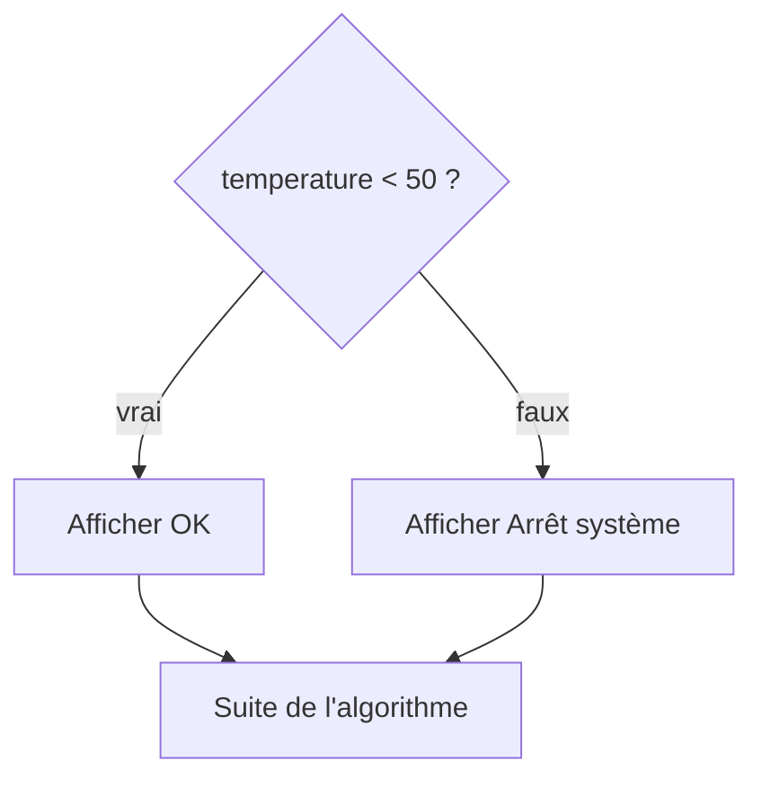
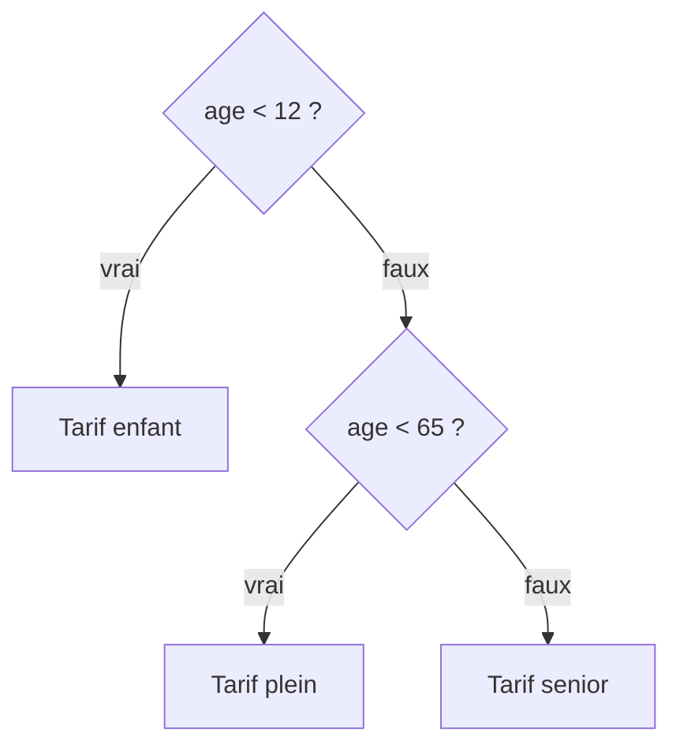

# Structures conditionnelles (alternatives)

Les conditions (tests) permettent d'exécuter un bloc d'instructions selon certaines circonstances.

---

## 1. SI / ALORS / SINON

### Syntaxe

```
SI <CONDITION> ALORS
  DEBUT_SI
    <instruction1>
  FIN_SI
[SINON
  DEBUT_SINON
    <instruction2>
  FIN_SINON]
```

Le bloc **SINON** est facultatif (case « Ajouter SINON » du bloc `SI` dans AlgoFab). Les marqueurs `DEBUT_SI` / `FIN_SI` sont ajoutés automatiquement par l'application : on place les instructions entre les deux.

Un seul des deux blocs est exécuté, puis l'algorithme continue après le `SI` :



### Exemple

```
VARIABLES
  temperature EST_DU_TYPE NOMBRE
DEBUT_ALGORITHME
  LIRE temperature
  SI (temperature < 50) ALORS
    DEBUT_SI
    AFFICHER "OK" ↵
    FIN_SI
  SINON
    DEBUT_SINON
    AFFICHER "Arrêt système" ↵
    FIN_SINON
FIN_ALGORITHME
```

Fichier : [exemples/07_si_sinon.algo](exemples/07_si_sinon.algo)

---

## 2. Conditions (comparaison)

Une condition est composée de :

1. **Une valeur**
2. **Un opérateur de comparaison**
3. **Une autre valeur**

### Opérateurs de comparaison

| Opérateur | Signification |
|-----------|---------------|
| `==` | égal à |
| `!=` | différent de |
| `<` | strictement inférieur |
| `<=` | inférieur ou égal |
| `>` | strictement supérieur |
| `>=` | supérieur ou égal |

> Attention : « est égal à » s'écrit `==`. Un `=` seul n'existe pas dans le langage (l'affectation se fait avec `PREND_LA_VALEUR`).

Les chaînes se comparent dans l'ordre alphabétique, caractère par caractère, selon leur code ASCII : `"A" < "B"`, mais aussi `"Z" < "a"` (majuscules avant minuscules).

### Exemple

```
VARIABLES
  mot1 EST_DU_TYPE CHAINE
  mot2 EST_DU_TYPE CHAINE
DEBUT_ALGORITHME
  mot1 PREND_LA_VALEUR "A"
  mot2 PREND_LA_VALEUR "B"
  SI (mot1 > mot2) ALORS
    DEBUT_SI
    AFFICHER "mot1 est plus grand que mot2" ↵
    FIN_SI
  SINON
    DEBUT_SINON
    AFFICHER "mot2 est plus grand que mot1" ↵
    FIN_SINON
FIN_ALGORITHME
```

Fichier : [exemples/07_comparaison_chaines.algo](exemples/07_comparaison_chaines.algo)

---

## 3. Conditions composées (ET / OU / NON)

| A | B | A `ET` B | A `OU` B |
|---|---|----------|----------|
| VRAI | VRAI | VRAI | VRAI |
| VRAI | FAUX | FAUX | VRAI |
| FAUX | VRAI | FAUX | VRAI |
| FAUX | FAUX | FAUX | FAUX |

### ET

Les 2 conditions doivent être **Vraies** pour que le tout soit Vrai.

```
SI (temperature < 50 ET pression < 180) ALORS
  DEBUT_SI
  AFFICHER "OK" ↵
  FIN_SI
SINON
  DEBUT_SINON
  AFFICHER "Arrêt système" ↵
  FIN_SINON
```

### OU

1 condition doit être **Vraie** pour que le tout soit Vrai.

```
SI (temperature >= 50 OU pression >= 180) ALORS
  DEBUT_SI
  AFFICHER "Arrêt système" ↵
  FIN_SI
SINON
  DEBUT_SINON
  AFFICHER "OK" ↵
  FIN_SINON
```

Fichier : [exemples/07_conditions_composees.algo](exemples/07_conditions_composees.algo)

Les deux tests sont équivalents : le contraire de « A ET B » est « (contraire de A) OU (contraire de B) ».

### NON

`NON` inverse une condition : `NON (temperature < 50)` est vrai quand `temperature >= 50`.

> Une condition longue gagne à être rangée dans une variable `BOOLEEN` au nom explicite : `surchauffe PREND_LA_VALEUR temperature >= 50`, puis `SI (surchauffe OU surpression) ALORS`.

---

## 4. Plusieurs cas : SI imbriqués

Pour choisir entre plus de deux cas, on place un `SI` dans le `SINON` du précédent. Les tests sont faits dans l'ordre : on n'arrive au deuxième que si le premier est faux.



```
VARIABLES
  age EST_DU_TYPE NOMBRE
DEBUT_ALGORITHME
  LIRE age
  SI (age < 12) ALORS
    DEBUT_SI
    AFFICHER "Tarif enfant" ↵
    FIN_SI
  SINON
    DEBUT_SINON
    SI (age < 65) ALORS
      DEBUT_SI
      AFFICHER "Tarif plein" ↵
      FIN_SI
    SINON
      DEBUT_SINON
      AFFICHER "Tarif senior" ↵
      FIN_SINON
    FIN_SINON
FIN_ALGORITHME
```

Fichier : [exemples/07_si_imbrique.algo](exemples/07_si_imbrique.algo)

Dans le deuxième test, inutile d'écrire `age >= 12 ET age < 65` : si on y arrive, `age >= 12` est déjà acquis.

---

## 5. Arrêter l'algorithme : TERMINER / ERREUR

Deux blocs arrêtent l'exécution **immédiatement**, où qu'ils se trouvent :

| Bloc | Effet |
|------|-------|
| `TERMINER` | Fin **normale**, comme si on atteignait `FIN_ALGORITHME` |
| `ERREUR expression` | Fin **anormale** : le message est affiché dans un bandeau au-dessus de la console |

### Exemple

```
VARIABLES
  dividende EST_DU_TYPE NOMBRE
  diviseur EST_DU_TYPE NOMBRE
DEBUT_ALGORITHME
  LIRE dividende
  LIRE diviseur
  SI (diviseur == 0) ALORS
    DEBUT_SI
    ERREUR "La division par zéro est impossible"
    FIN_SI
  SI (dividende == 0) ALORS
    DEBUT_SI
    AFFICHER "Le résultat est 0" ↵
    TERMINER
    FIN_SI
  AFFICHER "Le résultat est "
  AFFICHER dividende / diviseur ↵
FIN_ALGORITHME
```

Fichier : [exemples/07_terminer_erreur.algo](exemples/07_terminer_erreur.algo)

---

## Exercices

Fiche [exercices/07_conditions.md](exercices/07_conditions.md) : pair ou impair, comparaisons, température système, maintenance.
