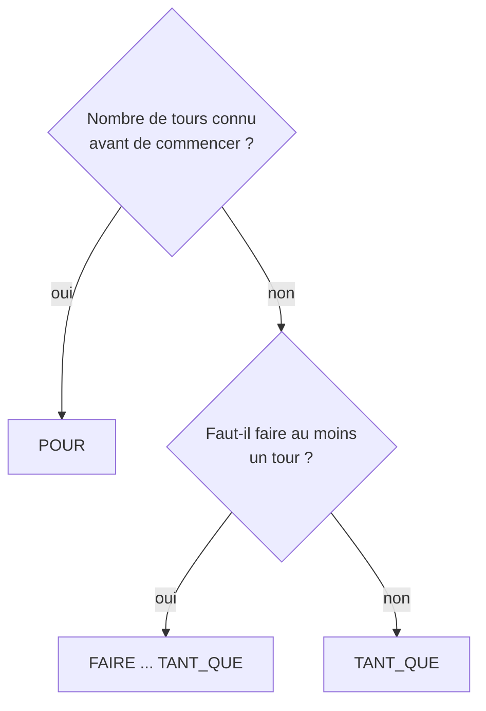
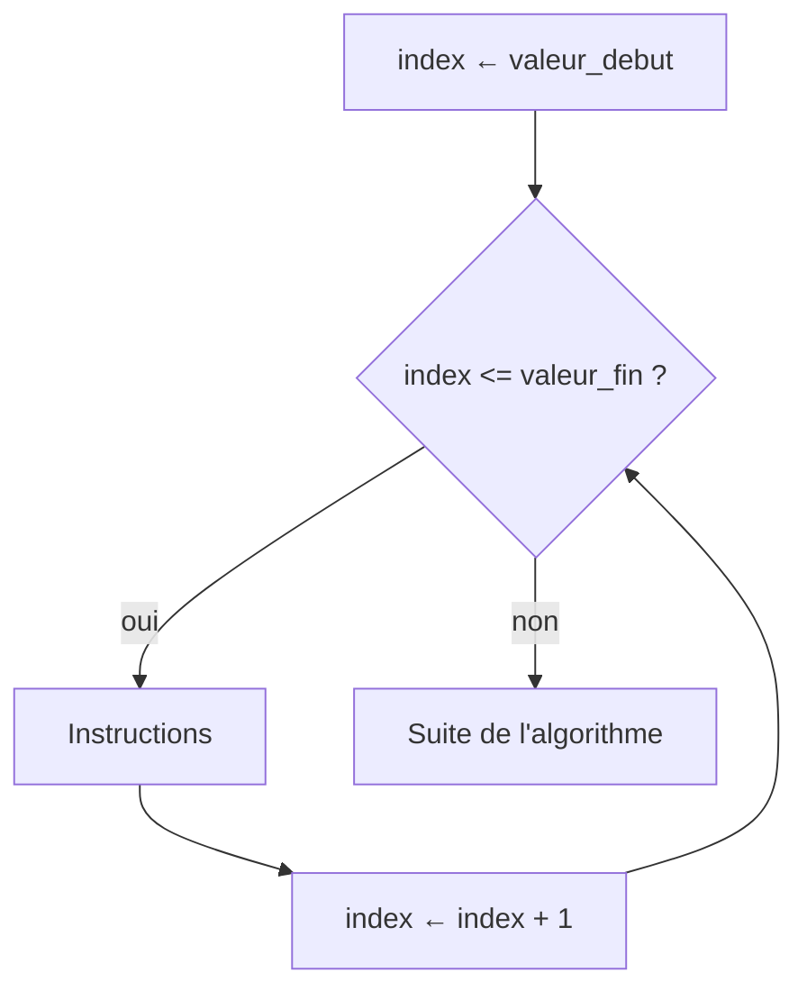
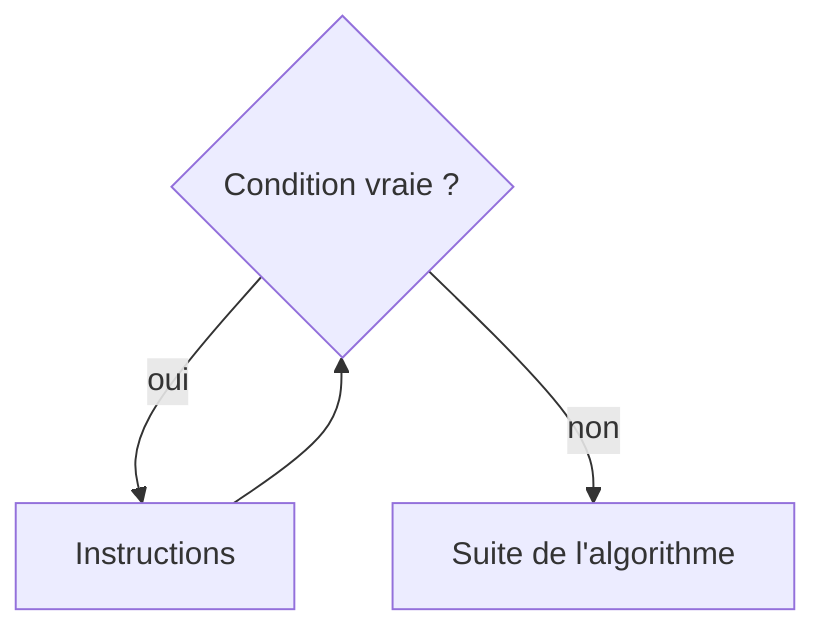
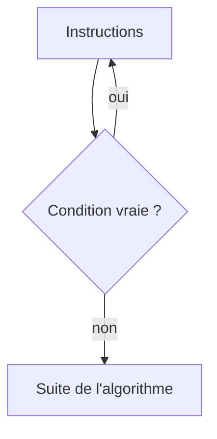

# Structures itératives : les boucles

## 1. Usage

Les boucles permettent de **répéter une série d'instructions** : saisir plusieurs valeurs, cumuler un total, parcourir des milliers de données. Chaque passage dans la boucle est un **tour** (une itération).

Deux types de boucles :

- **Nombre d'itérations connu à l'avance**, géré par un compteur
  - ex : "Pour i=1 jusqu'à 3, enrouler film autour palette"
- **La boucle s'arrête quand une condition est remplie**, gérée par un booléen
  - ex : "Tant que le mot de passe saisi est faux, ressaisir"



---

## 2. POUR ... ALLANT_DE (boucle compteur)

### Syntaxe

```
POUR index ALLANT_DE valeur_debut A valeur_fin
  DEBUT_POUR
  Instructions
  FIN_POUR
```

- La variable compteur (`index`) doit être déclarée, de type `NOMBRE`.
- Le compteur part de `valeur_debut` et avance de 1 à chaque tour, tant qu'il est inférieur ou égal à `valeur_fin`.



### Exemple : moyenne de la production de la semaine

```
VARIABLES
  jour EST_DU_TYPE NOMBRE
  production EST_DU_TYPE NOMBRE
  total EST_DU_TYPE NOMBRE
DEBUT_ALGORITHME
  total PREND_LA_VALEUR 0
  POUR jour ALLANT_DE 1 A 7
    DEBUT_POUR
    AFFICHER "Production du jour "
    AFFICHER jour
    AFFICHER " : "
    LIRE production
    AFFICHER production ↵
    total PREND_LA_VALEUR total + production
    FIN_POUR
  AFFICHER "Moyenne : "
  AFFICHER total / 7 ↵
FIN_ALGORITHME
```

Fichier : [exemples/08_pour_production.algo](exemples/08_pour_production.algo)

`total` est un **accumulateur** : initialisé **avant** la boucle (à `0` pour une somme, à `1` pour un produit), il cumule une valeur à chaque tour. La variable `production`, elle, est écrasée à chaque tour : impossible de revenir sur la production du lundi une fois la boucle finie. Pour conserver toutes les valeurs, il faudra un **tableau** (chapitre 09).

### Pas de la boucle : PAR_PAS_DE

Par défaut le compteur avance de 1. `PAR_PAS_DE` fixe un autre pas, éventuellement négatif pour un parcours décroissant. Un pas de `0` est une erreur (le compteur n'avancerait jamais).

```
VARIABLES
  i EST_DU_TYPE NOMBRE
DEBUT_ALGORITHME
  // de 0 à 10, de 2 en 2
  POUR i ALLANT_DE 0 A 10 PAR_PAS_DE 2
    DEBUT_POUR
    AFFICHER i
    AFFICHER " "
    FIN_POUR
  AFFICHER "" ↵
  // compte à rebours
  POUR i ALLANT_DE 5 A 1 PAR_PAS_DE -1
    DEBUT_POUR
    AFFICHER i
    AFFICHER " "
    FIN_POUR
  AFFICHER "Partez !" ↵
FIN_ALGORITHME
```

Fichier : [exemples/08_pour_pas.algo](exemples/08_pour_pas.algo)

---

## 3. TANT_QUE (boucle conditionnelle)

### Syntaxe

```
TANT_QUE (<expression booléenne>) FAIRE
  DEBUT_TANT_QUE
  Instructions
  FIN_TANT_QUE
```

La condition est testée **avant** chaque tour : si elle est fausse dès le départ, les instructions ne sont jamais exécutées. Les instructions doivent faire évoluer la condition, sinon la boucle est infinie (AlgoFab l'arrête après 500 000 tours).



### Exemple

```
VARIABLES
  mot_passe EST_DU_TYPE CHAINE
  essai_password EST_DU_TYPE CHAINE
  valide EST_DU_TYPE BOOLEEN
DEBUT_ALGORITHME
  valide PREND_LA_VALEUR FAUX
  mot_passe PREND_LA_VALEUR "SECRET"
  TANT_QUE (valide == FAUX) FAIRE
    DEBUT_TANT_QUE
    LIRE essai_password
    SI (essai_password == mot_passe) ALORS
      DEBUT_SI
      AFFICHER "OK" ↵
      valide PREND_LA_VALEUR VRAI
      FIN_SI
    SINON
      DEBUT_SINON
      AFFICHER "Echec" ↵
      FIN_SINON
    FIN_TANT_QUE
FIN_ALGORITHME
```

Fichier : [exemples/08_tant_que_mot_de_passe.algo](exemples/08_tant_que_mot_de_passe.algo)

---

## 4. FAIRE ... TANT_QUE (au moins un tour)

### Syntaxe

```
FAIRE TANT_QUE (<expression booléenne>)
  DEBUT_FAIRE_TANT_QUE
  Instructions
  FIN_FAIRE_TANT_QUE
```

Les instructions sont exécutées **une première fois**, puis la condition est testée : tant qu'elle est vraie, on recommence. La boucle tourne donc **au moins une fois**, ce qui convient bien à une saisie contrôlée.



### Exemple

```
VARIABLES
  note EST_DU_TYPE NOMBRE
DEBUT_ALGORITHME
  FAIRE TANT_QUE (note < 0 OU note > 20)
    DEBUT_FAIRE_TANT_QUE
    AFFICHER "Note entre 0 et 20 : "
    LIRE note
    FIN_FAIRE_TANT_QUE
  AFFICHER "Note enregistrée : "
  AFFICHER note ↵
FIN_ALGORITHME
```

Fichier : [exemples/08_faire_tant_que_saisie.algo](exemples/08_faire_tant_que_saisie.algo)

---

## 5. Boucles imbriquées

Une boucle peut contenir une autre boucle : pour **chaque** tour de la boucle extérieure, la boucle intérieure fait **tous** ses tours.

```
CONSTANTES
  N EST_DU_TYPE NOMBRE VALEUR 5
VARIABLES
  ligne EST_DU_TYPE NOMBRE
  colonne EST_DU_TYPE NOMBRE
DEBUT_ALGORITHME
  POUR ligne ALLANT_DE 1 A N
    DEBUT_POUR
    POUR colonne ALLANT_DE 1 A N
      DEBUT_POUR
      AFFICHER ligne * colonne
      AFFICHER " "
      FIN_POUR
    AFFICHER "" ↵
    FIN_POUR
FIN_ALGORITHME
```

Affichage :

```
1 2 3 4 5
2 4 6 8 10
3 6 9 12 15
4 8 12 16 20
5 10 15 20 25
```

Fichier : [exemples/08_boucles_imbriquees.algo](exemples/08_boucles_imbriquees.algo)

La ligne `AFFICHER ligne * colonne` est exécutée `N × N` fois, soit 25 fois : le coût des boucles imbriquées se **multiplie** (chapitre 12).

---

## Exercices

Fiche [exercices/08_boucles.md](exercices/08_boucles.md) : factorielle, division et racine par soustractions, moyenne de la classe, jeu de dés, triangles de Pythagore, chemin de vie.
