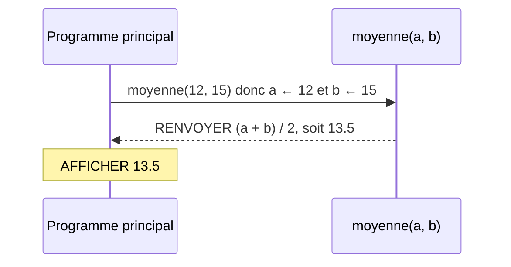
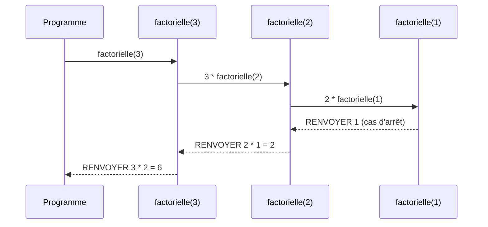

# Les fonctions

## 1. Pourquoi écrire des fonctions ?

Les fonctions intégrées (`sqrt`, `round`, `randint`..., chapitre [06](06_lecture_ecriture.md)) sont des traitements prêts à l'emploi. On peut aussi écrire **ses propres fonctions**, pour :

- **découper** un problème en sous-problèmes (analyse descendante, chapitre [04](04_algorithme_methodologie.md)) : un sous-problème = une fonction
- **réutiliser** un traitement sans le recopier
- **tester** et corriger chaque partie séparément

Elles se définissent dans la section `FONCTIONS_UTILISEES`.

---

## 2. Syntaxe

```
FONCTION nom_fonction(parametre1: TYPE, parametre2: TYPE) → TYPE_RETOUR
  VARIABLES_FONCTION
    <variables locales>
  DEBUT_FONCTION
  <instructions>
  RENVOYER <expression>
  FIN_FONCTION
```

- **Paramètres** : chacun a un nom et un type (`NOMBRE`, `CHAINE`, `BOOLEEN`, `LISTE`).
- **Type de retour** : ce que la fonction renvoie. `AUCUN` pour une fonction qui ne renvoie rien (procédure). Si le type de retour est `NOMBRE`, AlgoFab ne l'affiche pas dans l'arbre.
- **RENVOYER** termine la fonction et transmet le résultat à l'appelant.

---

## 3. Appel

Une fonction s'appelle dans une expression (`x PREND_LA_VALEUR moyenne(12, 15)`), ou avec le bloc **APPELER** quand il n'y a pas de résultat à utiliser (l'arbre affiche alors simplement l'appel : `afficher_titre("Fonctions")`).

À l'appel, les valeurs des **arguments** sont copiées dans les **paramètres**, dans l'ordre. La fonction s'exécute, puis `RENVOYER` transmet le résultat à l'appelant, qui reprend là où il s'était arrêté :



---

## 4. Portée des variables

Une fonction ne voit que ses paramètres, ses variables locales et les constantes. Les variables du programme principal ne sont **pas** accessibles : on les passe en paramètre.

| Élément | Visible dans le programme principal | Visible dans la fonction |
|---------|-------------------------------------|--------------------------|
| Variables de la section `VARIABLES` | oui | non |
| Paramètres et variables de `VARIABLES_FONCTION` | non | oui |
| Constantes | oui | oui |

---

## 5. Récursivité

Une fonction peut s'appeler elle-même (ici `factorielle`, car n! = n × (n - 1)!). Il faut un **cas d'arrêt** (`n <= 1`) atteint à coup sûr, sinon les appels ne s'arrêtent jamais (AlgoFab stoppe au-delà de 5 000 appels imbriqués).



---

## 6. Exemple

```
FONCTIONS_UTILISEES
  FONCTION afficher_titre(titre: CHAINE) → AUCUN
    VARIABLES_FONCTION
    DEBUT_FONCTION
    AFFICHER "=== "
    AFFICHER titre
    AFFICHER " ===" ↵
    FIN_FONCTION
  FONCTION moyenne(a: NOMBRE, b: NOMBRE)
    VARIABLES_FONCTION
    DEBUT_FONCTION
    RENVOYER (a + b) / 2
    FIN_FONCTION
  FONCTION factorielle(n: NOMBRE)
    VARIABLES_FONCTION
    DEBUT_FONCTION
    SI (n <= 1) ALORS
      DEBUT_SI
      RENVOYER 1
      FIN_SI
    RENVOYER n * factorielle(n - 1)
    FIN_FONCTION
VARIABLES
  n EST_DU_TYPE NOMBRE
DEBUT_ALGORITHME
  afficher_titre("Fonctions")
  LIRE n
  AFFICHER "Moyenne de 12 et 15 : "
  AFFICHER moyenne(12, 15) ↵
  AFFICHER "Factorielle : "
  AFFICHER factorielle(n) ↵
FIN_ALGORITHME
```

Fichier : [exemples/10_fonctions_utilisateur.algo](exemples/10_fonctions_utilisateur.algo)

---

## Exercices

Fiche [exercices/10_fonctions.md](exercices/10_fonctions.md) : maximum, nombres premiers, approximation de PI, PGCD, interclassement de tableaux.
