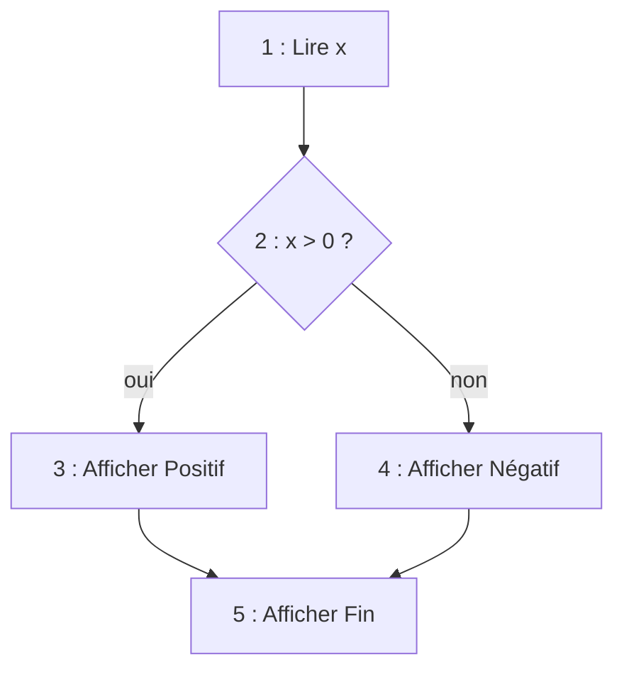

# Complexité cyclomatique

## 1. Définition

La **complexité cyclomatique** est une métrique inventée par **Thomas McCabe** en 1976.

Elle mesure la **complexité logique d'un algorithme ou d'un programme** en comptant le **nombre de chemins d'exécution indépendants** dans le code.

Plus il y a de structures de contrôle (`si`, `selon`, boucles…),
plus le programme est **difficile à comprendre, tester et maintenir**.

---

## 2. À quoi sert la complexité cyclomatique ?

Elle sert à :
- évaluer la **lisibilité** d'un algorithme
- estimer le **nombre minimum de tests** nécessaires pour couvrir tous les chemins
- repérer un code **trop compliqué** à maintenir
- guider les décisions de **refactorisation** (simplification du code)

**Ce n'est pas une complexité de temps** (contrairement à `O(n)`, chapitre 12).
Elle ne dit rien sur la vitesse d'exécution, mais sur la **structure logique**.

---

## 3. Calcul simplifié

La complexité cyclomatique correspond à :

> **V(G) = 1 + nombre de décisions dans le programme**

Une **décision** est toute instruction qui crée une **bifurcation** :
- `si` / `sinon si`
- `tant que`
- `pour`
- `répéter … jusqu'à`
- chaque `cas` d'un `selon / switch`
- chaque opérateur logique `ET` / `OU` dans une condition composée

**Attention** : `sinon` seul ne compte pas comme une décision (c'est le chemin par défaut).

Dans AlgoFab, les décisions sont `SI`, `POUR`, `TANT_QUE`, `FAIRE ... TANT_QUE` et chaque `ET` / `OU` de leurs conditions ; un « sinon si » s'écrit avec un `SI` dans le `SINON` et compte donc comme un `SI`. **Vérifier** affiche la complexité cyclomatique du programme principal et de chaque fonction.

---

## 4. Exemples

---

### Exemple 1 : Algorithme sans condition

```text
Lire a
Lire b
Afficher a + b
```

Nombre de décisions : 0
Complexité cyclomatique = **1**

Un seul chemin d'exécution, un seul test suffit.

---

### Exemple 2 : Un test `si`

```text
Si note ≥ 10 alors
   Afficher "Admis"
Sinon
   Afficher "Refusé"
Fin Si
```

Décisions : 1 (`si`)
Complexité cyclomatique = **2**

Deux chemins possibles, il faut **au minimum 2 tests** :
1. Un cas où `note ≥ 10`
2. Un cas où `note < 10`

---

### Exemple 3 : Test + boucle

```text
Pour i de 1 à n
   Si T[i] = x alors
      Afficher "Trouvé"
   Fin Si
Fin Pour
```

Décisions :
- `pour` : 1
- `si` : 1

Complexité cyclomatique = **3**

Trois chemins : la boucle ne s'exécute pas, la boucle s'exécute sans trouver, la boucle trouve l'élément.

---

### Exemple 4 : Conditions imbriquées

```text
Si a > b alors
   Afficher a
Sinon
   Si b > c alors
      Afficher b
   Sinon
      Afficher c
   Fin Si
Fin Si
```

Décisions : 2 (`si a > b`, `si b > c`)
Complexité cyclomatique = **3**

Trois chemins possibles :
1. `a > b` : affiche a
2. `a ≤ b` et `b > c` : affiche b
3. `a ≤ b` et `b ≤ c` : affiche c

---

### Exemple 5 : Condition composée avec `ET` / `OU`

```text
Si (age ≥ 18) ET (permis = vrai) alors
   Afficher "Peut conduire"
Sinon
   Afficher "Ne peut pas conduire"
Fin Si
```

Décisions : 2 (le `si` + l'opérateur `ET` qui crée un chemin supplémentaire)
Complexité cyclomatique = **3**

Chaque opérateur logique `ET` / `OU` ajoute un chemin car chaque condition peut être évaluée indépendamment (évaluation en court-circuit).

---

### Exemple 6 : Graphe de flot de contrôle

Prenons cet algorithme :

```text
Lire x                    <- Noeud 1
Si x > 0 alors            <- Noeud 2 (décision)
   Afficher "Positif"     <- Noeud 3
Sinon
   Afficher "Négatif"     <- Noeud 4
Fin Si
Afficher "Fin"            <- Noeud 5
```

Le graphe correspondant : chaque instruction est un **nœud**, chaque passage possible de l'une à l'autre est un **arc**.



Sur le graphe, V(G) = arcs − nœuds + 2 = 5 − 5 + 2 = **2** : deux chemins, 1-2-3-5 et 1-2-4-5.

En pratique, la méthode **1 + nombre de décisions** donne le bon résultat rapidement :
1 + 1 décision = **2**

---

## 5. Interprétation des valeurs

| Complexité cyclomatique | Interprétation | Risque |
|------------------------|----------------|--------|
| 1 à 5 | Code simple | Faible, facile à tester |
| 6 à 10 | Code modérément complexe | Acceptable, attention aux tests |
| 11 à 20 | Code complexe | Difficile à maintenir, refactorisation conseillée |
| > 20 | Code très complexe | Très risqué, à simplifier impérativement |

On vise **des algorithmes simples et lisibles** (complexité ≤ 5).

---

## 6. Comment réduire la complexité cyclomatique ?

| Problème | Solution |
|----------|----------|
| Trop de `si` imbriqués | Utiliser des **retours anticipés** ou découper en sous-fonctions |
| Longue chaîne `si / sinon si` | Utiliser un `selon` (switch) ou une **table de correspondance** |
| Boucle avec beaucoup de conditions | Extraire la logique dans une **fonction séparée** |
| Conditions composées complexes | Stocker les conditions dans des **variables booléennes nommées** |

### Exemple de simplification

**Avant** (complexité = 4) :
```text
Si age < 0 alors
   Afficher "Erreur"
Sinon
   Si age < 18 alors
      Afficher "Mineur"
   Sinon
      Si age < 65 alors
         Afficher "Adulte"
      Sinon
         Afficher "Senior"
      Fin Si
   Fin Si
Fin Si
```

**Après** (même complexité, mais plus lisible grâce à la structure plate) :
```text
Si age < 0 alors
   Afficher "Erreur"
Sinon Si age < 18 alors
   Afficher "Mineur"
Sinon Si age < 65 alors
   Afficher "Adulte"
Sinon
   Afficher "Senior"
Fin Si
```

La complexité cyclomatique reste la même (4), mais le code est **moins profondément imbriqué**, donc plus facile à lire.

---

## 7. Lien avec les tests

La complexité cyclomatique indique le **nombre minimum de cas de test** nécessaires pour couvrir tous les chemins d'exécution :

| Complexité | Nombre minimum de tests |
|-----------|------------------------|
| V(G) = 1 | 1 test |
| V(G) = 3 | 3 tests |
| V(G) = 7 | 7 tests |

C'est pourquoi on veut la garder basse : moins de chemins = **moins de tests à écrire**, moins de bugs possibles.

---

## 8. Différence avec la complexité algorithmique

| | Complexité algorithmique | Complexité cyclomatique |
|---|-------------------------|-------------------------|
| **Mesure** | Temps / mémoire d'exécution | Nombre de chemins logiques |
| **Dépend de** | La taille des données `n` | Le nombre de décisions |
| **Notation** | `O(n)`, `O(n^2)`… | Un entier (1, 2, 3…) |
| **Objectif** | Évaluer la **performance** | Évaluer la **maintenabilité** |
| **Exemple** | Tri par sélection : `O(n^2)` | Tri par sélection : V(G) = 4 |

---

## 9. À retenir

- La complexité cyclomatique mesure le **nombre de chemins d'exécution indépendants**
- Formule simplifiée : **V(G) = 1 + nombre de décisions**
- Les opérateurs `ET` / `OU` dans les conditions comptent comme des décisions supplémentaires
- Elle détermine le **nombre minimum de tests** pour couvrir tout le code
- Un algorithme trop complexe (> 10) doit être **simplifié** (découpage en fonctions)
- Objectif : **rester en dessous de 5**

---

## Exercices

Fiche [exercices/13_complexite_cyclomatique.md](exercices/13_complexite_cyclomatique.md) : calculer V(G), lister les chemins et les cas de test, simplifier une solution trop complexe.
