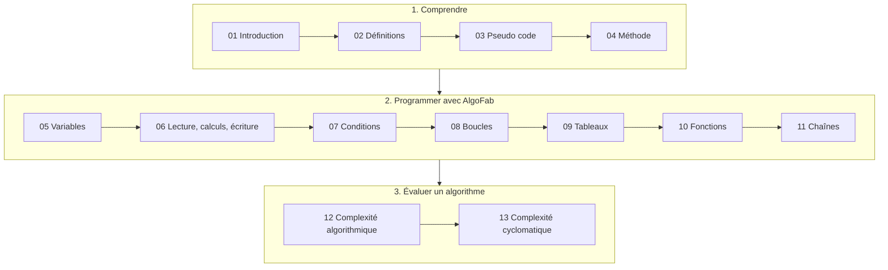

# Introduction à l'algorithmie

Apprendre à réaliser un algorithme, ou comment résoudre un problème en structurant la mise en oeuvre d'une solution.

Le cours part d'exemples de la vie courante, introduit le vocabulaire et le pseudo-code, puis met en pratique chaque notion (variables, conditions, boucles, tableaux, fonctions, chaînes de caractères) avec **AlgoFab**, avant d'apprendre à évaluer un algorithme (complexité).

---

## AlgoFab

[AlgoFab](https://algofab.mips.science) est une application web d'écriture et d'exécution d'algorithmes en français, sous forme d'**arbre de blocs** (`VARIABLES`, `SI ... ALORS`, `POUR ... ALLANT_DE`, `TANT_QUE`...). Rien à installer : un navigateur suffit, et l'application fonctionne aussi hors ligne.

Le travail se fait en trois étapes :

1. **Coder** : construire l'algorithme en insérant des blocs
2. **Vérifier** : l'application repère les erreurs avant l'exécution (variable non déclarée, variable utilisée sans valeur, type incorrect...) et explique comment les corriger ; elle estime aussi la complexité (chapitres 12 et 13)
3. **Exécuter** : la console affiche le résultat ; l'exécution pas à pas permet de suivre l'évolution des variables

Les exemples et les solutions du cours sont des fichiers `.algo` : dans AlgoFab, menu **Algorithmes → Ouvrir algo**. La référence complète du langage est accessible par le bouton **Aide** de l'application.

---

## Plan du cours

Chaque chapitre ne s'appuie que sur les précédents et se termine par une fiche d'exercices.

| Chapitre | Contenu | Exercices |
|----------|---------|-----------|
| [01 - Introduction à l'algorithmie](01_introduction_algorithmie.md) | Définition, exemple concret, généralisation, qualités d'un algorithme | |
| [02 - Quelques définitions](02_definitions_vocabulaire.md) | Du problème au programme, lexique informatique, modes d'exécution | |
| [03 - Le pseudo code](03_pseudo_code.md) | Conventions, correspondance avec AlgoFab, organigramme | [fiche 03](exercices/03_pseudo_code.md) |
| [04 - L'algorithme](04_algorithme_methodologie.md) | Analyse descendante, trois structures, syntaxe globale AlgoFab | [fiche 04](exercices/04_algorithme.md) |
| [05 - Les variables](05_variables.md) | Déclaration, types (NOMBRE, CHAINE, BOOLEEN, LISTE), affectation, tableau de trace, constantes | [fiche 05](exercices/05_variables.md) |
| [06 - Lecture, calculs et écriture](06_lecture_ecriture.md) | LIRE, opérateurs, fonctions intégrées, conversions, AFFICHER | [fiche 06](exercices/06_lecture_ecriture.md) |
| [07 - Structures conditionnelles](07_structures_conditionnelles.md) | SI / ALORS / SINON, comparaisons, ET / OU / NON, SI imbriqués, TERMINER / ERREUR | [fiche 07](exercices/07_conditions.md) |
| [08 - Structures itératives](08_structures_iteratives.md) | POUR, PAR_PAS_DE, TANT_QUE, FAIRE ... TANT_QUE, accumulateur, boucles imbriquées | [fiche 08](exercices/08_boucles.md) |
| [09 - Les tableaux](09_tableaux.md) | LISTE, indices, parcours, recherche, tri par sélection, tableau à 2 dimensions | [fiche 09](exercices/09_tableaux.md) |
| [10 - Les fonctions](10_fonctions.md) | Fonctions utilisateur : paramètres, RENVOYER, portée, récursivité | [fiche 10](exercices/10_fonctions.md) |
| [11 - Chaînes de caractères](11_chaines_de_caracteres.md) | length, substr, charat, asc, char, parcours, tests sur les caractères, table ASCII | [fiche 11](exercices/11_chaines.md) |
| [12 - Complexité algorithmique](12_complexite_algorithmique.md) | Notation grand O, règles de calcul, meilleur / pire cas, complexité spatiale, mesure | [fiche 12](exercices/12_complexite_algorithmique.md) |
| [13 - Complexité cyclomatique](13_complexite_cyclomatique.md) | Calcul, graphe de flot, interprétation, réduction, lien avec les tests | [fiche 13](exercices/13_complexite_cyclomatique.md) |

Les algorithmes présentés dans le cours sont dans le dossier [exemples](exemples/), préfixés par le numéro du chapitre. Les exercices, leur progression et les solutions : [exercices/README.md](exercices/README.md).
