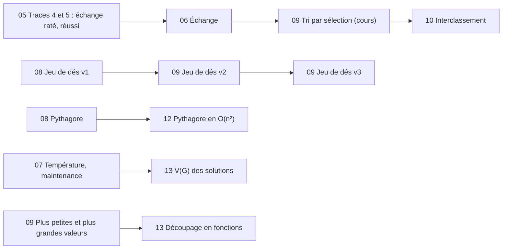

# Exercices

Une fiche par chapitre : chaque fiche n'utilise que les notions vues **jusqu'à ce chapitre**. La difficulté est indiquée par des étoiles :

- ★ application directe du cours
- ★★ plusieurs notions à combiner
- ★★★ problème à analyser (décomposition, cas particuliers)

Les solutions sont des fichiers `.algo` du dossier [solutions](solutions/), préfixés par le numéro du chapitre, à ouvrir dans [AlgoFab](https://algofab.mips.science) (menu **Algorithmes → Ouvrir algo**). Chercher avant de les ouvrir !

| Chapitre | Fiche | Exercices |
|----------|-------|-----------|
| 03 - Pseudo code | [03_pseudo_code.md](03_pseudo_code.md) | remettre dans l'ordre, pseudo code, organigramme |
| 04 - L'algorithme | [04_algorithme.md](04_algorithme.md) | analyse descendante, structures, premier algorithme AlgoFab |
| 05 - Variables | [05_variables.md](05_variables.md) | tableaux de trace |
| 06 - Lecture, calculs, écriture | [06_lecture_ecriture.md](06_lecture_ecriture.md) | conversions, carré, caisse, échange, permutation, durée |
| 07 - Conditions | [07_conditions.md](07_conditions.md) | pair ou impair, comparaisons, température, maintenance |
| 08 - Boucles | [08_boucles.md](08_boucles.md) | factorielle, division et racine par soustractions, moyenne de la classe, jeu de dés, Pythagore, chemin de vie |
| 09 - Tableaux | [09_tableaux.md](09_tableaux.md) | minimum, maximum et moyenne, jeu de dés v2 et v3, plus petites et plus grandes valeurs |
| 10 - Fonctions | [10_fonctions.md](10_fonctions.md) | maximum, nombres premiers, approximation de PI, PGCD, interclassement |
| 11 - Chaînes | [11_chaines.md](11_chaines.md) | caractères, voyelles, majuscules et minuscules, date, atoi, URL, occurrences, mot de passe |
| 12 - Complexité algorithmique | [12_complexite_algorithmique.md](12_complexite_algorithmique.md) | grand O, comparaisons du tri, dichotomie, Pythagore en O(n²), mesure dans AlgoFab |
| 13 - Complexité cyclomatique | [13_complexite_cyclomatique.md](13_complexite_cyclomatique.md) | calcul de V(G), chemins et cas de test, découpage en fonctions |

Évaluation : [TP Algo](TP_algo.md) (chapitres 05 à 11), sans solution fournie.

## Fils rouges

Plusieurs exercices reprennent un travail précédent pour l'enrichir avec les notions du nouveau chapitre :

