<!-- _class: chapitre -->
<!-- _paginate: false -->
<!-- _footer: "" -->

# Introduction à l'algorithmie

Résoudre un problème en structurant la mise en oeuvre d'une solution

Pseudo code et pratique avec **AlgoFab**

---

## Plan du cours


Chaque chapitre ne s'appuie que sur les précédents et se termine par une fiche d'exercices.

---

## AlgoFab

Application web d'écriture et d'exécution d'algorithmes en français : https://algofab.mips.science

1. **Coder** : construire l'algorithme en arbre de blocs
2. **Vérifier** : erreurs signalées et expliquées avant l'exécution, estimation de la complexité
3. **Exécuter** : console, exécution pas à pas, suivi des variables

Exemples et solutions du cours : fichiers `.algo`, menu **Algorithmes → Ouvrir algo**

---

<!-- _class: chapitre -->

# 01

## Introduction à l'algorithmie

---

## Qu'est-ce qu'un algorithme ?

Une suite **finie** d'instructions **non ambiguës** qui transforme des **données** en un **résultat**.

- une recette de cuisine
- un itinéraire
- une notice de montage

Apprendre l'algorithmie : structurer la solution **avant** de l'écrire dans un langage de programmation.

---

## Exemple : ranger l'armoire de bricolage

**Objectif** : ranger son armoire de bricolage pour la voiture


Trois briques : des actions **en séquence**, une **condition**, une **répétition**.

---

## Généraliser la solution

- Puis-je appliquer cet enchaînement à mon univers Vélo ? Menuiserie ? Cuisine ?
- Qu'est-ce qui change ? La définition de l'univers et la liste des objets.

Seules les **données** changent : l'algorithme reste le même.

---

## Qu'est-ce qu'un bon algorithme ?

| Qualité | Question à se poser | Chapitres |
|---------|---------------------|-----------|
| **Correct** | Donne-t-il le bon résultat, et se termine-t-il toujours ? | tout le cours |
| **Lisible** | Un autre développeur le comprend-il ? | 04, 10 |
| **Efficace** | Combien d'opérations quand les données grossissent ? | 12 |
| **Simple** | Combien de chemins d'exécution faut-il tester ? | 13 |

Un ordinateur plus puissant ne rend pas un algorithme inefficace efficace.

---

<!-- _class: chapitre -->

# 02

## Quelques définitions

---

## Du problème au programme


| Terme | Définition |
|-------|------------|
| **Algorithme** | Méthode de résolution, indépendante de tout langage |
| **Pseudo code** | Organisé comme un langage, sans les soucis de syntaxe |
| **Langage de programmation** | Convention d'instructions organisées (Python, C, PHP...) |
| **Programmation** | Traduction de l'algorithme dans un langage |

---

## Mémoire et modes d'exécution

- **Bit** : 0 ou 1 — **octet** : 8 bits, soit 256 valeurs
- **ASCII** : chaque caractère correspond à un nombre (`A` vaut 65)

| Mode | Principe | Exemples |
|------|----------|----------|
| **Compilation** | Traduit une seule fois en exécutable : plus rapide | C, C++ |
| **Interprétation** | Traduit ligne par ligne à l'exécution : multi-plateforme | VBA, PHP |
| **Semi-compilé** | Code intermédiaire, puis interprétation | Python, Java |

AlgoFab est un **interpréteur** : il exécute l'algorithme pas à pas.

---

<!-- _class: chapitre -->

# 03

## Le pseudo code

---

## Le pseudo code

Pas de standard, des conventions : **mots clés**, **une instruction par ligne**, **indentation**, `←` pour l'affectation.

| Pseudo code libre | AlgoFab |
|-------------------|---------|
| `x ← 3` | `x PREND_LA_VALEUR 3` |
| `Lire x`, `Afficher x` | `LIRE x`, `AFFICHER x` |
| `Si ... Alors ... Sinon ...` | `SI (...) ALORS ... SINON ...` |
| `Pour i de 1 à n` | `POUR i ALLANT_DE 1 A n` |
| `Tant que ... Faire` | `TANT_QUE (...) FAIRE` |
| `Répéter ... Jusqu'à condition` | `FAIRE TANT_QUE (NON condition)` |

---

## L'organigramme


| Forme | Signification |
|-------|---------------|
| Ovale | Début, fin |
| Rectangle | Action |
| Parallélogramme | Entrée, sortie |
| Losange | Décision oui / non |

Exemple : « Travail de la journée »

```
TANT QUE il y a une tâche FAIRE
    Lire tâche
    Réaliser tâche
    Passer à la tâche suivante
FIN TANT QUE
```

---

<!-- _class: chapitre -->

# 04

## L'algorithme

---

## Analyse descendante

Décomposer un problème complexe en sous-problèmes simples, puis recomposer les solutions.


Objectifs : **modularité**, **lisibilité**, **complexité maîtrisée**.

---

## Trois structures suffisent


**Séquentielle** (chapitres 05, 06) — **Conditionnelle** (07) — **Itérative** (08)

---

## Un algorithme AlgoFab

Cinq sections, toujours dans cet ordre :

```
FONCTIONS_UTILISEES     (facultatif)
CONSTANTES              (facultatif)
VARIABLES
DEBUT_ALGORITHME
FIN_ALGORITHME
```

À l'exécution : fonctions enregistrées, constantes calculées, variables créées **sans valeur**, puis instructions exécutées dans l'ordre.

---

## Premier exemple : une séquence

```
VARIABLES
  puissance EST_DU_TYPE NOMBRE
  intensite EST_DU_TYPE NOMBRE
  tension EST_DU_TYPE NOMBRE
DEBUT_ALGORITHME
  puissance PREND_LA_VALEUR 4400
  intensite PREND_LA_VALEUR 20
  tension PREND_LA_VALEUR puissance / intensite
  AFFICHER tension ↵
FIN_ALGORITHME
```

Fichier : `exemples/04_tension.algo`

---

<!-- _class: chapitre -->

# 05

## Les variables

---

## Une variable : nom, type, valeur

| Type | Contient | Exemples |
|------|----------|----------|
| `NOMBRE` | entiers et nombres à virgule | `10`, `3.14` |
| `CHAINE` | texte entre guillemets | `"Hello"`, `"69000"` |
| `BOOLEEN` | `VRAI` ou `FAUX`, ou une comparaison | `qte_piece > 0` |
| `LISTE` | valeurs numérotées à partir de 0 (chapitre 09) | `[12, 25, 7]` |

Nom : sans espace ni accent, commence par une lettre, pas un mot réservé (`nombre`, `valeur`...). Convention **snake_case** : `nb_essais`.

---

## Affectation

```
variable PREND_LA_VALEUR expression
```

- l'expression est **calculée**, puis rangée dans la variable : l'ancienne valeur est perdue
- **Déclarer n'est pas affecter** : lire une variable sans valeur est une erreur
- `somme PREND_LA_VALEUR somme + i` utilise l'**ancienne** valeur de `somme`
- une **constante** (`TAUX_TVA`, en majuscules) ne change jamais

---

## Le tableau de trace

Valeur de chaque variable **après** chaque instruction :

| Instruction | `x` | `y` |
|-------------|-----|-----|
| `x PREND_LA_VALEUR 3` | 3 | ? |
| `y PREND_LA_VALEUR x * 2` | 3 | 6 |
| `x PREND_LA_VALEUR x + y` | 9 | 6 |

Une variable ne contient **qu'une valeur à la fois**. L'exécution pas à pas d'AlgoFab affiche ce suivi.

---

<!-- _class: chapitre -->

# 06

## Lecture, calculs et écriture

---

## Entrées, traitement, sorties


- `LIRE x` : saisie au clavier (un `NOMBRE` peut être tapé comme un calcul : `3+4`)
- `AFFICHER expr` : texte, variable ou calcul ; **↵** passe à la ligne
- plusieurs `AFFICHER` sans **↵** s'écrivent sur la même ligne
- un `AFFICHER "Rayon : "` avant le `LIRE` guide l'utilisateur

---

## Opérateurs

| Opérateur | Rôle | Exemple | Résultat |
|-----------|------|---------|----------|
| `+` `-` `*` `/` | opérations de base | `7 / 2` | `3.5` |
| `%` | reste de la division entière | `17 % 5` | `2` |
| `^` | puissance | `2 ^ 3` | `8` |

- priorités des mathématiques : `^`, puis `*` `/` `%`, puis `+` `-`
- `n % 2 == 0` : `n` est pair ; `n % 10` : chiffre des unités
- division entière : quotient `int(a / b)`, reste `a % b`

---

## Fonctions intégrées et conversions

| Fonction | Rôle | Exemple |
|----------|------|---------|
| `sqrt(x)`, `abs(x)` | racine carrée, valeur absolue | `sqrt(16)` vaut `4` |
| `round(x, n)` | arrondi à n décimales | `round(3.14159, 2)` vaut `3.14` |
| `int(x)` | partie entière | `int(3.9)` vaut `3` |
| `max(a, b, ...)`, `min(...)` | plus grand, plus petit | `max(4, 9, 2)` vaut `9` |
| `randint(p, n)` | entier aléatoire entre p et n | `randint(1, 6)` |
| `int(chaine)`, `tostring(nombre)` | conversions | `int("153")`, `tostring(42)` |

Attention : `"a" + 1` donne `"a1"` (concaténation).

---

## Exemple : aire d'un disque

```
VARIABLES
  rayon EST_DU_TYPE NOMBRE
  aire EST_DU_TYPE NOMBRE
DEBUT_ALGORITHME
  AFFICHER "Rayon du disque : "
  LIRE rayon
  AFFICHER rayon ↵
  aire PREND_LA_VALEUR PI * rayon ^ 2
  AFFICHER "Aire : "
  AFFICHER round(aire, 2) ↵
FIN_ALGORITHME
```

Saisie `2` → `Aire : 12.57`

---

<!-- _class: chapitre -->

# 07

## Structures conditionnelles

---

## SI / ALORS / SINON


```
SI (temperature < 50) ALORS
  DEBUT_SI
  AFFICHER "OK" ↵
  FIN_SI
SINON
  DEBUT_SINON
  AFFICHER "Arrêt système" ↵
  FIN_SINON
```

Un seul des deux blocs est exécuté. Le `SINON` est facultatif.

---

## Conditions

| `==` | `!=` | `<` | `<=` | `>` | `>=` |
|------|------|-----|------|-----|------|
| égal | différent | inférieur | inférieur ou égal | supérieur | supérieur ou égal |

- « est égal à » s'écrit `==` ; `=` seul n'existe pas
- chaînes : ordre alphabétique des codes ASCII (`"Z" < "a"`)

| A | B | A `ET` B | A `OU` B |
|---|---|----------|----------|
| VRAI | VRAI | VRAI | VRAI |
| VRAI | FAUX | FAUX | VRAI |
| FAUX | FAUX | FAUX | FAUX |

`NON` inverse une condition : `NON (temperature < 50)`.

---

## Plusieurs cas : SI imbriqués


Un `SI` dans le `SINON` du précédent.

Les tests sont faits dans l'ordre : au deuxième test, `age >= 12` est déjà acquis.

Arrêt immédiat de l'algorithme :

- `TERMINER` : fin normale
- `ERREUR "message"` : fin anormale, message affiché

---

<!-- _class: chapitre -->

# 08

## Structures itératives

---

## Quelle boucle choisir ?


Chaque passage dans la boucle est un **tour** (une itération).

---

## POUR : boucle compteur


```
total PREND_LA_VALEUR 0
POUR jour ALLANT_DE 1 A 7
  DEBUT_POUR
  LIRE production
  total PREND_LA_VALEUR total + production
  FIN_POUR
AFFICHER total / 7 ↵
```

- `total` est un **accumulateur** : initialisé avant la boucle (0 pour une somme, 1 pour un produit)
- `PAR_PAS_DE 2`, `PAR_PAS_DE -1` : autre pas, parcours décroissant

---

## TANT_QUE et FAIRE ... TANT_QUE


| `TANT_QUE (cond) FAIRE` | `FAIRE TANT_QUE (cond)` |
|-------------------------|-------------------------|
| peut ne jamais tourner | tourne **au moins une fois** |
| ex. : mot de passe | ex. : saisie contrôlée |

Le corps doit faire évoluer la condition, sinon la boucle est infinie.

---

## Boucles imbriquées

```
POUR ligne ALLANT_DE 1 A N
  DEBUT_POUR
  POUR colonne ALLANT_DE 1 A N
    DEBUT_POUR
    AFFICHER ligne * colonne
    AFFICHER " "
    FIN_POUR
  AFFICHER "" ↵
  FIN_POUR
```

Pour **chaque** tour de la boucle extérieure, la boucle intérieure fait **tous** ses tours : `N × N` affichages.

---

<!-- _class: chapitre -->

# 09

## Les tableaux

---

## Conserver toutes les valeurs

Une variable `LISTE` stocke N éléments numérotés **à partir de 0** :

| Indice | 0 | 1 | 2 | 3 | 4 | 5 | 6 |
|--------|---|---|---|---|---|---|---|
| `production[indice]` | 10 | 12 | 14 | 9 | 11 | 13 | 15 |

- accès : `production[0]`, `production[i]`, `production[2*k+1]`
- remplissage : `tableau PREND_LA_VALEUR [5, 4, 3]` ou élément par élément
- `length(tableau)` : nombre d'éléments ; dernier indice `length(tableau) - 1`
- parcours : `POUR i ALLANT_DE 0 A length(tableau) - 1`

---

## Recherche d'une valeur

```
i PREND_LA_VALEUR 0
TANT_QUE (i < length(tableau) ET tableau[i] != cherche) FAIRE
  DEBUT_TANT_QUE
  i PREND_LA_VALEUR i + 1
  FIN_TANT_QUE
```

- trouvée si `i < length(tableau)`
- meilleur cas : 1 tour (valeur en tête)
- pire cas : `n` tours (valeur absente)

---

## Tri par sélection

Chercher le plus petit élément et l'échanger avec le premier, puis recommencer sur le reste.

| Tour `i` | Plus petit entre `i` et la fin | Tableau après l'échange |
|----------|--------------------------------|-------------------------|
| départ | | 5 3 8 1 4 |
| 0 | 1 (indice 3) | **1** 3 8 5 4 |
| 1 | 3 (déjà en place) | 1 **3** 8 5 4 |
| 2 | 4 (indice 4) | 1 3 **4** 5 8 |
| 3 | 5 (déjà en place) | 1 3 4 **5** 8 |

Deux boucles imbriquées ; l'échange utilise une variable `temporaire`.

---

## Tableau à 2 dimensions

AlgoFab ne connaît que les tableaux à 1 dimension : les lignes sont rangées l'une après l'autre.

```
tableau[li * nb_colonnes + col] PREND_LA_VALEUR 12
```

| | colonne 0 | colonne 1 | colonne 2 |
|---|---|---|---|
| **ligne 0** | indice 0 | indice 1 | indice 2 |
| **ligne 1** | indice 3 | indice 4 | indice 5 |

---

<!-- _class: chapitre -->

# 10

## Les fonctions

---

## Pourquoi écrire des fonctions ?

- **découper** : un sous-problème de l'analyse descendante = une fonction
- **réutiliser** un traitement sans le recopier
- **tester** chaque partie séparément

```
FONCTION moyenne(a: NOMBRE, b: NOMBRE)
  VARIABLES_FONCTION
  DEBUT_FONCTION
  RENVOYER (a + b) / 2
  FIN_FONCTION
```

Type de retour `AUCUN` : procédure, appelée avec le bloc **APPELER**.

---

## Appel et portée

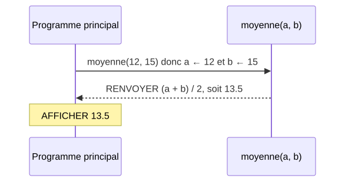

| Élément | Programme principal | Fonction |
|---------|---------------------|----------|
| Variables de `VARIABLES` | visible | **non visible** |
| Paramètres, `VARIABLES_FONCTION` | non visible | visible |
| Constantes | visible | visible |

---

## Récursivité

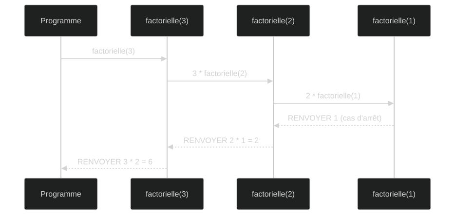

Une fonction qui s'appelle elle-même a besoin d'un **cas d'arrêt** atteint à coup sûr.

---

<!-- _class: chapitre -->

# 11

## Chaînes de caractères

---

## Une chaîne, une suite de caractères

| Position | 0 | 1 | 2 | 3 | 4 |
|----------|---|---|---|---|---|
| `"Algo!"` | `A` | `l` | `g` | `o` | `!` |

| Fonction | Exemple | Résultat |
|----------|---------|----------|
| `+`, `concat(a, b)` | `"Bon" + "jour"` | `"Bonjour"` |
| `length(chaine)` | `length("Algorithmie")` | `11` |
| `substr(chaine, debut, n)` | `substr("Programmation", 3, 4)` | `"gram"` |
| `charat(chaine, pos)` | `charat("ABCD", 1)` | `"B"` |
| `asc(c)`, `char(code)` | `asc("A")`, `char(65)` | `65`, `"A"` |

---

## Parcourir, construire, tester

- **parcourir** : `POUR i ALLANT_DE 0 A length(chaine) - 1` et `charat(chaine, i)`
- **construire** : partir de `""` et concaténer un morceau à chaque tour

| Besoin | Expression |
|--------|------------|
| `c` est une majuscule | `c >= "A" ET c <= "Z"` |
| `c` est un chiffre | `c >= "0" ET c <= "9"` |
| minuscule de la majuscule `c` | `char(asc(c) + 32)` |
| valeur du chiffre `c` | `asc(c) - asc("0")` |

---

<!-- _class: chapitre -->

# 12

## Complexité algorithmique

---

## Mesurer l'efficacité

Ressources nécessaires en fonction de la **taille des données** `n` : **temps** et **mémoire**, indépendamment de la machine.

Notation **grand O** : on garde le terme dominant, sans constante : `3n² + 5n + 2` devient `O(n²)`.

| Structure | Coût |
|-----------|------|
| instruction simple | `O(1)` |
| instructions en séquence | on **additionne** : la plus coûteuse l'emporte |
| boucle de `n` tours | `n` × coût du corps |
| boucles imbriquées | on **multiplie** : `O(n²)` pour deux boucles de `n` tours |

---

## Classes de complexité

| Complexité | Nom | Exemple |
|------------|-----|---------|
| `O(1)` | constante | accès par indice |
| `O(log n)` | logarithmique | recherche dichotomique |
| `O(n)` | linéaire | recherche d'une valeur, moyenne |
| `O(n log n)` | quasi-linéaire | tri fusion |
| `O(n²)` | quadratique | tri par sélection |
| `O(n³)` | cubique | triangles de Pythagore à trois boucles |

---

## Ordres de grandeur

| n | O(log n) | O(n) | O(n log n) | O(n²) |
|---|----------|------|------------|-------|
| 10 | 3 | 10 | 33 | 100 |
| 1 000 | 10 | 1 000 | 10 000 | 1 000 000 |
| 1 000 000 | 20 | 1 000 000 | 20 000 000 | 10¹² |

À un milliard d'opérations par seconde, trier 1 million de valeurs prend **0,02 s** en `O(n log n)`, environ **17 minutes** en `O(n²)`.

---

## Pire cas et mesure

- on étudie surtout le **pire cas** : il garantit une borne supérieure
- recherche d'une valeur : 1 comparaison au mieux, `n` au pire, donc `O(n)`
- complexité **spatiale** : mémoire en plus des données (`O(1)` si en place)

Dans AlgoFab :

- **Vérifier** estime la complexité en temps et en espace
- après exécution, le compteur de **tours de boucle** : `n` doublé → tours × 2 en `O(n)`, × 4 en `O(n²)`

---

<!-- _class: chapitre -->

# 13

## Complexité cyclomatique

---

## Compter les chemins

Métrique de **McCabe** (1976) : nombre de **chemins d'exécution indépendants**.

> **V(G) = 1 + nombre de décisions**

- décisions : `SI`, `POUR`, `TANT_QUE`, `FAIRE ... TANT_QUE`, chaque `ET` / `OU` d'une condition
- `SINON` ne compte pas
- V(G) = nombre minimum de **cas de test** pour couvrir tous les chemins

Ce n'est pas une complexité de temps : elle mesure la **structure logique**.

---

## Graphe de flot


Chaque instruction est un **nœud**, chaque passage possible un **arc**.

V(G) = arcs − nœuds + 2 = 5 − 5 + 2 = **2**

Deux chemins : 1-2-3-5 et 1-2-4-5, donc deux tests : `x > 0` et `x ≤ 0`.

---

## Interpréter et réduire

| V(G) | Interprétation |
|------|----------------|
| 1 à 5 | simple, facile à tester |
| 6 à 10 | modérément complexe |
| 11 à 20 | complexe, refactorisation conseillée |
| > 20 | très risqué, à simplifier |

Réduire : **découper en fonctions**, retours anticipés, conditions rangées dans des **booléens nommés**.

---

## Deux complexités à ne pas confondre

| | Complexité algorithmique | Complexité cyclomatique |
|---|--------------------------|-------------------------|
| **Mesure** | temps, mémoire | nombre de chemins logiques |
| **Dépend de** | la taille des données `n` | le nombre de décisions |
| **Notation** | `O(n)`, `O(n²)`... | un entier |
| **Objectif** | la **performance** | la **maintenabilité** |
| **Exemple** | tri par sélection : `O(n²)` | tri par sélection : V(G) = 4 |

---

## Exercices

Une fiche par chapitre, dans `exercices/` :

- ★ application directe, ★★ plusieurs notions, ★★★ problème à analyser
- solutions `.algo` dans `exercices/solutions/`, à ouvrir dans AlgoFab
- des fils rouges : jeu de dés v1 → v2 → v3, échange → tri → interclassement, Pythagore → version `O(n²)`
- évaluation : **TP Algo** (chapitres 05 à 11)

---

## À retenir

- un algorithme : une suite finie d'instructions, construite avec **séquence**, **condition** et **répétition**
- **analyse descendante** : décomposer jusqu'à des sous-problèmes simples, puis en faire des **fonctions**
- une variable n'a qu'**une valeur à la fois** : le **tableau de trace** le montre
- **tableaux** pour conserver des valeurs, **boucles** pour les parcourir
- évaluer : **grand O** pour la performance, **V(G)** pour la maintenabilité
